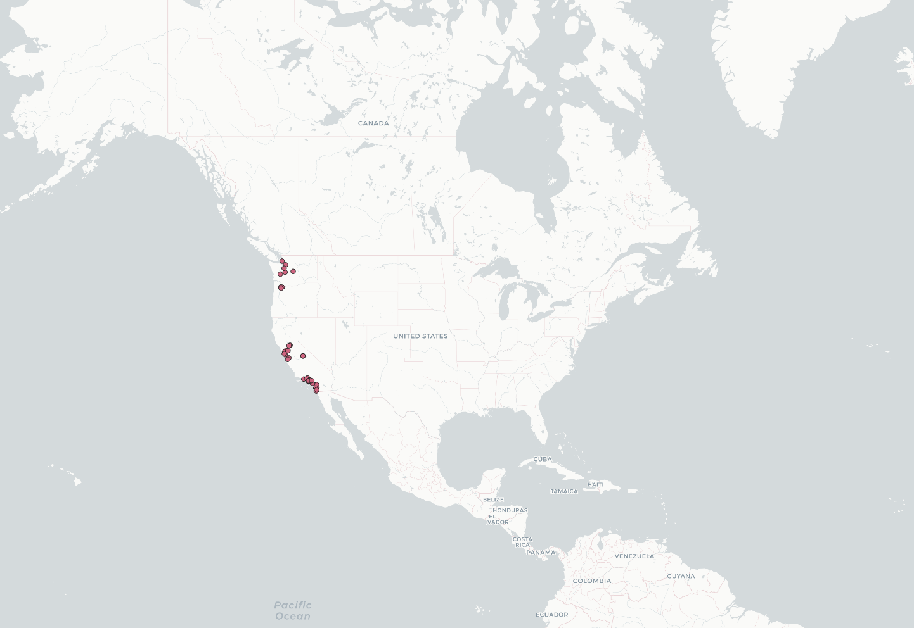

# Lab 2
## GEOG458 AA
### Anthea Li

For this lab, I chose to compare the search term "Amber Heard" for the following two places: the entire United States (including Alaska and Hawaii) and just the West Coast of the U.S. I chose this topic because of the trial taking place between Amber Heard and Johnny Depp. I chose these two locations because I was curious about the locations in which most of the discourse is taking place.

These are the maps of the geolocations of the tweets found with the given crawler for the entire U.S. and the West Coast, respectively:

From these two maps, you're able to see that there's a slightly higher concentration in the tweets tagged with locations around the west coast when the location of the crawlers is centered there. Initially, when choosing the locations to look at, I assumed there would be a much more significant difference in the concentration of points along the west coast since both crawlers were constrained by the same amount of time. However, that doesn't seem to be the case so I can only conclude that the tweets that were ommitted from the crawler for the entire U.S. lie elsewhere. 

These are the wordmaps generated from the tweets located in the entire U.S. and the West Coast, respectively:

It's evident from first glance that the main difference between the two wordmaps is that the one generated from west coast tweets is much more centered on politics. The one generated from the entire U.S. doesn't seem to have any clear patterns. This was an unexpected outcome--I expected there to be keywords related to the filter keyword I had chosen, which was Amber Heard. After seeing this outcome, I also tried multiple variations of the keyword ("Amber", "Heard", "Johnny Depp", etc.) with similarly unrelated results every time.

Regardless, it is interesting that the tweets located on the West Coast are more political. When looking further into the full tweets, many tweets with "Trump" in them are critical of him, which would make sense since the west coast is a fairly liberal area.
